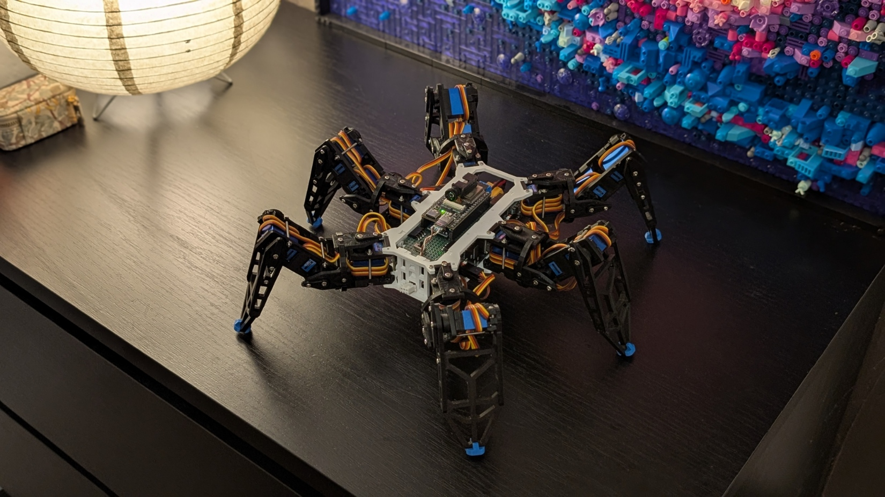
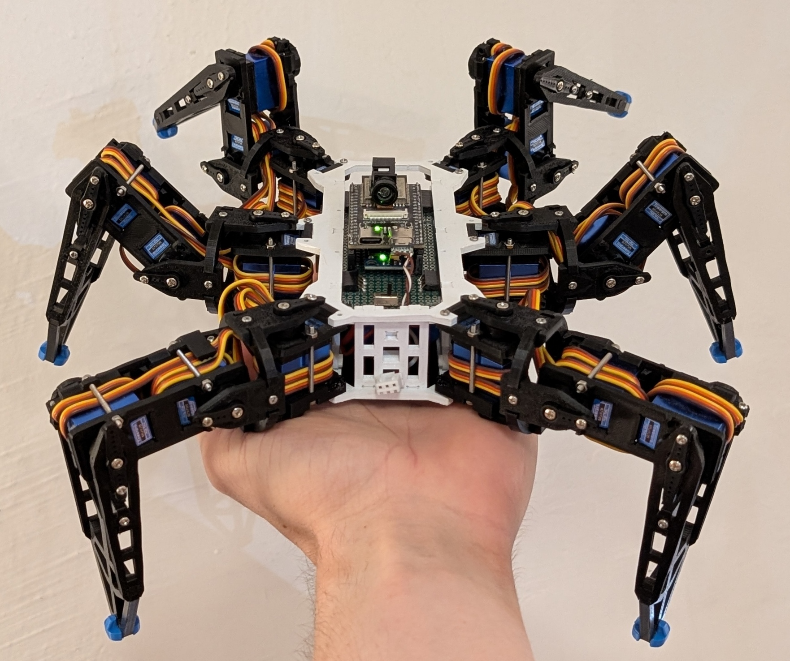

<div align="center">
  <h1>
    <a href="https://github.com/runeharlyk/Hexapod">
      
    </a>
    <br />  
    Hexapod - Ant 🐜
  </h1>
  <h4>A small hexapod robot, based on <a href="https://github.com/SmallpTsai/hexapod-v2-7697">SmallpTsai/hexapod-v2-7697</a></h4>

<!-- [](https://github.com/runeharlyk/Hexapod/actions/workflows/frontend-tests.yml)
[](https://github.com/runeharlyk/Hexapod/actions/workflows/embedded-build.yml) -->

</div>

## 📜 Overview

This is my implementation of SmallpTsai hexapod.
Its built with:

- An ESP32 S3 with camera
- Two PCA9685
- 18 MG92B servos
- A MPU6050 + HMC5883L
- Two 18650 in a 2s2p configuration
- 7 buck converters




### 🎮 Controller

The [controller](https://runeharlyk.github.io/Hexapod/) is a svelte app which is deployed using github pages.
The app lets you control the robot using either JSON or MsgPack over BLE and websockets.
It includes full control over robot settings like network and calibration, and a visualization.

## Simulation

A pybullet simulation is available in `/simulation`


## 🔮 Getting started

1. Clone and open the new project

   ```sh
   git clone https://github.com/runeharlyk/Hexapod
   ```

1. Install dependencies with preferable package manager (npm, pnpm, yarn)

   ```sh
   cd app
   pnpm install
   ```

1. Upload filesystem image using platformIO

1. Upload firmware using platformIO

## ☕ Support

If you like the project and want to follow its evolution, consider ✨-ing the project

## 📃 License

[MIT](LICENSE.md)

---

> [runeharlyk.dk](https://runeharlyk.dk) &nbsp;&middot;&nbsp;
> GitHub [@runeharlyk](https://github.com/runeharlyk) &nbsp;&middot;&nbsp;
> LinkedIn [@Rune Harlyk](https://www.linkedin.com/in/rune-harlyk/)
